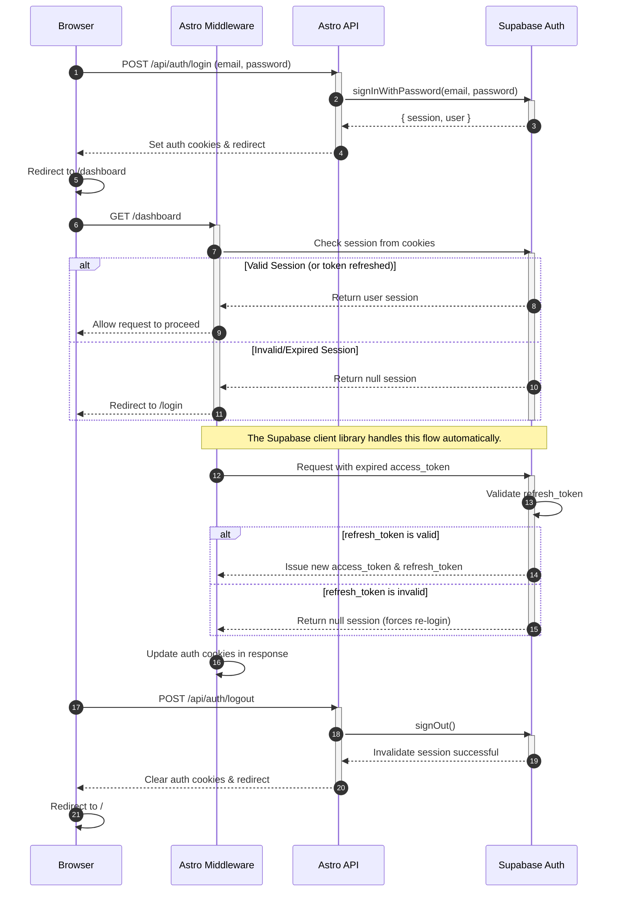

<mermaid_diagram>

```mermaid
sequenceDiagram
    autonumber

    participant Browser
    participant Middleware as Astro Middleware
    participant API as Astro API
    participant Auth as Supabase Auth

    %% User Login Flow
    Browser->>API: POST /api/auth/login (email, password)
    activate API
    API->>Auth: signInWithPassword(email, password)
    activate Auth
    Auth-->>API: { session, user }
    deactivate Auth
    API-->>Browser: Set auth cookies & redirect
    deactivate API
    Browser->>Browser: Redirect to /dashboard

    %% Accessing a Protected Route
    Browser->>Middleware: GET /dashboard
    activate Middleware
    Middleware->>Auth: Check session from cookies
    activate Auth
    alt Valid Session (or token refreshed)
        Auth-->>Middleware: Return user session
        Middleware-->>Browser: Allow request to proceed
    else Invalid/Expired Session
        Auth-->>Middleware: Return null session
        Middleware-->>Browser: Redirect to /login
    end
    deactivate Auth
    deactivate Middleware

    %% Automatic Token Refresh (handled by Middleware)
    Note over Middleware,Auth: The Supabase client library handles this flow automatically.
    Middleware->>Auth: Request with expired access_token
    activate Auth
    Auth->>Auth: Validate refresh_token
    alt refresh_token is valid
        Auth-->>Middleware: Issue new access_token & refresh_token
    else refresh_token is invalid
        Auth-->>Middleware: Return null session (forces re-login)
    end
    deactivate Auth
    Middleware->>Middleware: Update auth cookies in response

    %% User Logout Flow
    Browser->>API: POST /api/auth/logout
    activate API
    API->>Auth: signOut()
    activate Auth
    Auth-->>API: Invalidate session successful
    deactivate Auth
    API-->>Browser: Clear auth cookies & redirect
    deactivate API
    Browser->>Browser: Redirect to /
```

</mermaid_diagram>
