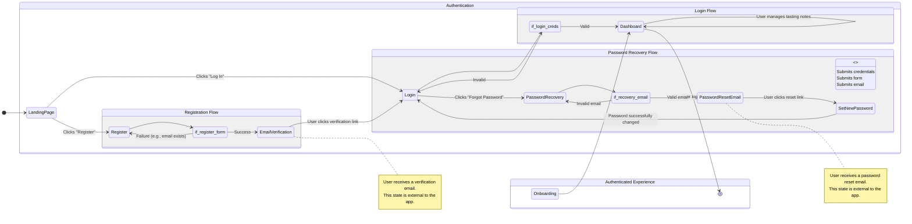

<mermaid_diagram>

```mermaid
stateDiagram-v2
    direction LR
    [*] --> LandingPage

    state "Authenticated Experience" as Authenticated {
        Onboarding --> Dashboard
        Dashboard --> Dashboard: User manages tasting notes
        Dashboard --> [*]: User logs out
    }

    state "Authentication" as Auth {
        direction TB
        LandingPage --> Login: Clicks "Log In"
        LandingPage --> Register: Clicks "Register"

        state "Login Flow" as LoginProcess {
            Login --> if_login_creds <<choice>>: Submits credentials
            if_login_creds --> Dashboard: Valid
            if_login_creds --> Login: Invalid
            Login --> PasswordRecovery: Clicks "Forgot Password"
        }

        state "Registration Flow" as RegisterProcess {
            Register --> if_register_form <<choice>>: Submits form
            if_register_form --> EmailVerification: Success
            note right of EmailVerification
                User receives a verification email.
                This state is external to the app.
            end note
            if_register_form --> Register: Failure (e.g., email exists)
            EmailVerification --> Login: User clicks verification link
        }

        state "Password Recovery Flow" as RecoveryProcess {
            PasswordRecovery --> if_recovery_email <<choice>>: Submits email
            if_recovery_email --> PasswordResetEmail: Valid email
            note right of PasswordResetEmail
                User receives a password reset email.
                This state is external to the app.
            end note
            if_recovery_email --> PasswordRecovery: Invalid email
            PasswordResetEmail --> SetNewPassword: User clicks reset link
            SetNewPassword --> Login: Password successfully changed
        }
    }
```

</mermaid_diagram>
