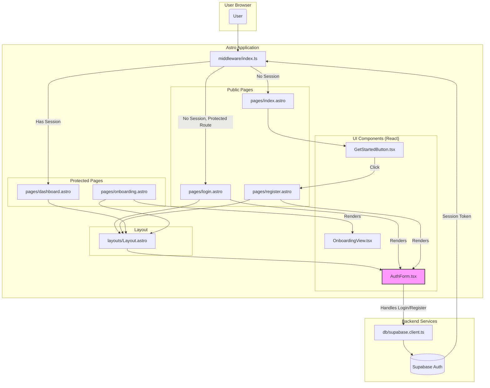

<mermaid_diagram>

```mermaid
flowchart TD
    subgraph "User Browser"
        direction LR
        User(User)
    end

    subgraph "Astro Application"
        direction TB

        Middleware["middleware/index.ts"]

        subgraph "Public Pages"
            direction LR
            PageIndex["pages/index.astro"]
            PageLogin["pages/login.astro"]
            PageRegister["pages/register.astro"]
        end

        subgraph "Protected Pages"
            direction LR
            PageDashboard["pages/dashboard.astro"]
            PageOnboarding["pages/onboarding.astro"]
        end

        subgraph "UI Components (React)"
            direction TB
            AuthForm["AuthForm.tsx"]:::updated
            OnboardingView["OnboardingView.tsx"]
            GetStarted["GetStartedButton.tsx"]
        end

        subgraph "Layout"
            direction TB
            AstroLayout["layouts/Layout.astro"]
        end
    end

    subgraph "Backend Services"
        direction TB
        SupabaseClient["db/supabase.client.ts"]
        SupabaseAuth[("Supabase Auth")]
    end

    %% Styling
    classDef updated fill:#f9f,stroke:#333,stroke-width:2px;

    %% Flow
    User --> Middleware

    Middleware -- "No Session" --> PageIndex
    Middleware -- "No Session, Protected Route" --> PageLogin
    Middleware -- "Has Session" --> PageDashboard

    PageIndex --> GetStarted
    GetStarted -- "Click" --> PageRegister

    PageLogin --> AstroLayout
    PageRegister --> AstroLayout
    PageDashboard --> AstroLayout
    PageOnboarding --> AstroLayout

    AstroLayout --> AuthForm
    PageLogin -- "Renders" --> AuthForm
    PageRegister -- "Renders" --> AuthForm

    PageOnboarding -- "Renders" --> OnboardingView

    AuthForm -- "Handles Login/Register" --> SupabaseClient
    SupabaseClient --> SupabaseAuth
    SupabaseAuth -- "Session Token" --> Middleware
```

</mermaid_diagram>
